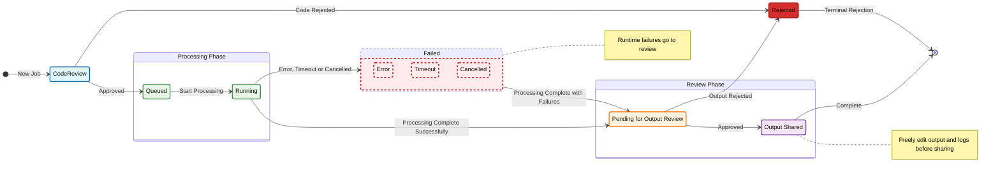

```mermaid
stateDiagram-v2
    direction LR

    %% Style definitions with enhanced error states
    classDef initial fill:#e1f5fe,stroke:#01579b,stroke-width:2px
    classDef process fill:#e8f5e9,stroke:#2e7d32,stroke-width:2px
    classDef review fill:#fff3e0,stroke:#ef6c00,stroke-width:2px
    classDef error fill:#ffebee,stroke:#c62828,stroke-width:3px,stroke-dasharray: 5 5
    classDef reject fill:#d32f2f,stroke:#b71c1c,stroke-width:3px
    classDef complete fill:#f3e5f5,stroke:#6a1b9a,stroke-width:2px

    state "CodeReview" as pending_for_approval
    state "Queued" as queued
    state "Running" as running
    state "Failed" as failed {
        state "Error" as error
        state "Timeout" as timeout
        state "Cancelled" as cancelled
    }
    state "Rejected" as rejected
    state "Pending for Output Review" as pending_for_output_review
    state "Output Shared" as output_shared

    [*] --> pending_for_approval: New Job

    pending_for_approval --> queued: Approved
    pending_for_approval --> rejected: Code Rejected

    queued --> running: Start Processing
    running --> failed: Error, Timeout or Cancelled
    failed --> pending_for_output_review: Processing Complete with Failures

    running --> pending_for_output_review: Processing Complete Successfully

    pending_for_output_review --> output_shared: Approved
    pending_for_output_review --> rejected: Output Rejected

    output_shared --> [*]: Complete
    rejected --> [*]: Terminal Rejection

    %% Apply styles
    class pending_for_approval initial
    class queued,running process
    class pending_for_output_review review
    class failed,error,timeout,cancelled error
    class rejected reject
    class output_shared complete

    %% Note states
    note right of failed: Runtime failures go to review
    note right of output_shared: Freely edit output and logs before sharing

    %% Composite states
    state "Processing Phase" as processing {
        queued
        running
    }

    state "Review Phase" as review {
        pending_for_output_review
        output_shared
    }
```
